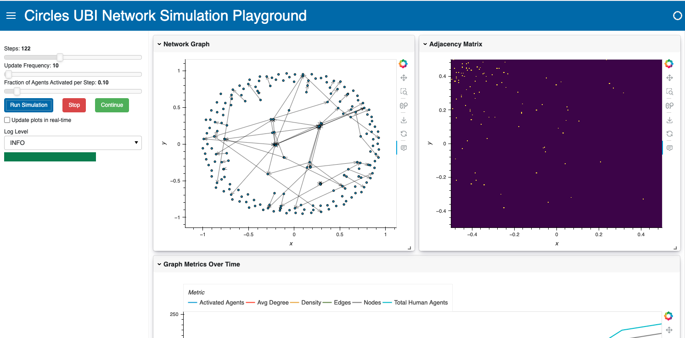
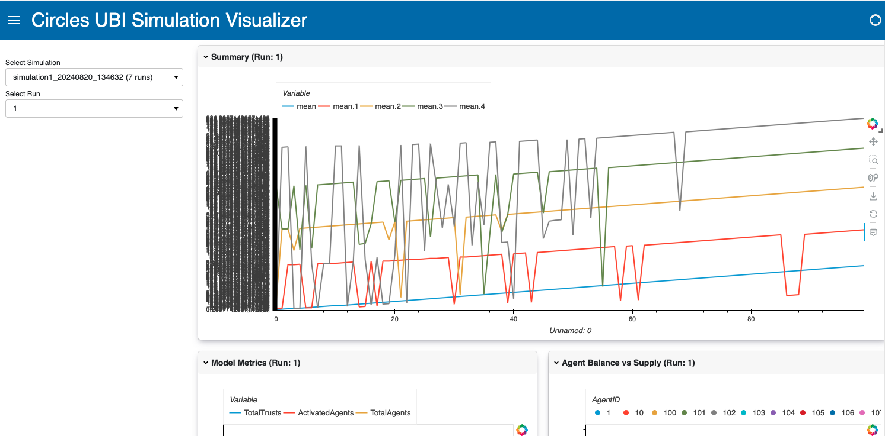

# Circles UBI: Economic Modeling and Simulation


<p float="left">
  
  
</p>


## Table of Contents
1. [Introduction](#introduction)
2. [Project Structure](#project-structure)
3. [CirclesUBI Implementation](#circlesubi-implementation)
4. [Simulation Components](#simulation-components)
   - [run.py](#runpy)
   - [visualizer.py](#visualizerpy)
   - [playground.py](#playgroundpy)
5. [Installation](#installation)
6. [Usage](#usage)
7. [Current Status](#current-status)
8. [To-Do List](#to-do-list)

## Introduction

This project implements a simulation of the CirclesUBI (Universal Basic Income) system using the Mesa agent-based modeling framework and visualizes the results using Panel. The simulation models the creation, distribution, and transfer of a time-based currency within a network of trusted connections.

CirclesUBI is a decentralized Universal Basic Income system that uses personal currencies and a web of trust to create a fair and inclusive economy. This simulation aims to model and analyze the behavior of such a system under various conditions.

## Project Structure

The project is organized into several key components:

- `ABM_simulation/`: Core implementation of the CirclesUBI system and agent-based model
  - `model.py`: Mesa model implementation (CirclesNetwork)
  - `agents.py`: Definition of agent types (HumanAgent, HubAgent)
  - `logger.py`: Custom logging setup
- `run.py`: Configurable simulation runner
- `visualizer.py`: Data visualization for completed simulation runs
- `playground.py`: Interactive simulation playground
- `data/`: Directory for storing simulation output data

## CirclesUBI Implementation

The `ABM_simulation` module contains the core logic for the Circles currency system:

- `CirclesNetwork`: The main model class that sets up and runs the simulation
- `HumanAgent`: Represents individual participants in the CirclesUBI system
- `HubAgent`: Represents hub nodes in the network (not fully implemented)

Key features include:
- Time-based currency issuance
- Dynamic creation of new agents
- Establishment of trust relationships
- Periodic currency minting

## Simulation Components

### run.py

`run.py` is a configurable simulation runner that allows users to define simulation parameters via a YAML configuration file. It provides the following functionality:

- Load simulation parameters from a YAML file
- Run multiple simulation instances
- Save simulation results (model data, agent data, and graph data) to CSV and JSON files
- Generate summary statistics across multiple runs

Usage: `python run.py config_simulation/config.yaml`

### visualizer.py

`visualizer.py` is a Panel-based visualization tool for analyzing completed simulation runs. It offers:

- Selection of specific simulation runs from saved data
- Interactive plots for various metrics over time
- Network graph visualization
- Summary statistics display

Usage: `python visualizer.py`

### playground.py

`playground.py` provides an interactive simulation playground for real-time experimentation. Features include:

- Adjustable simulation parameters (steps, update frequency, activation fraction)
- Real-time visualization of network graph, adjacency matrix, and various metrics
- Controls for starting, stopping, and continuing simulations
- Customizable log levels for debugging

Usage: `python playground.py`

## Installation

1. Clone the repository:
   ```
   git clone https://github.com/hdser/circlesubi-simulation.git
   cd circlesubi-simulation
   ```

2. Create a virtual environment (optional but recommended):
   ```
   python -m venv venv
   source venv/bin/activate  # On Windows, use `venv\Scripts\activate`
   ```

3. Install the required packages:
   ```
   pip install -r requirements.txt
   ```

## Usage

1. Run a configured simulation:
   ```
   python run.py config_simulation/config.yaml
   ```

2. Visualize saved simulation results:
   ```
   python visualizer.py
   ```

3. Launch the interactive playground:
   ```
   python playground.py
   ```

4. Access the visualizations in your web browser at the URL provided in the console output.

## Current Status

The project is currently in active development. Key features implemented include:

- Basic CirclesUBI model with agent creation and trust relationship establishment
- Currency minting mechanism
- Data collection for various network and economic metrics
- Visualization tools for both completed runs and real-time simulations

However, several important features are still under development:

- Currency transfers between agents are not yet implemented
- Proper implementation of demurrage is pending
- Path finding for multi-hop transfers is not yet available
- The HubAgent class is defined but not fully integrated into the simulation

## To-Do List

1. Implement currency transfers between agents
2. Develop a path-finding algorithm for multi-hop transfers
3. Properly implement demurrage calculations
4. Create a simulation mode with a fixed network size to focus on transfers and money flow
5. Enhance summary statistics for multiple runs
6. Implement more sophisticated trust relationship dynamics
7. Add economic indicators and analysis tools
8. Develop scenarios for testing different economic policies
9. Optimize performance for larger-scale simulations
10. Implement data export features for further analysis in external tools
11. Create more detailed documentation and usage guides
12. Develop unit tests and integration tests
13. Add configuration options for different network topologies
